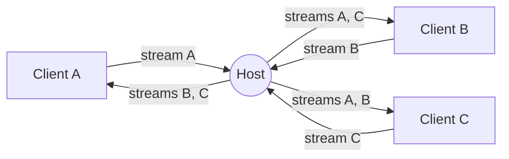

<div align="center">
    <a href="https://www.predatorray.me/rendezvous/" target="_blank"></a>
    <h3><em>wo Gespräche zusammenkommen – serverlos.</em></h3>
</div>

<p align="center">
    Eine <b><i>serverlose</i></b>, Zoom-ähnliche Web-App für Videokonferenzen,<br>
    gebaut mit React, TypeScript, MUI und PeerJS auf Basis von WebRTC.
</p>

<p align="center">
    <a href="https://discord.gg/VPYRT538n"></a>
    <a href="https://github.com/predatorray/rendezvous/blob/main/LICENSE"></a>
    <a href="https://github.com/predatorray/rendezvous/actions/workflows/ci.yml"></a>
    <a href="https://github.com/predatorray/rendezvous/actions/workflows/publish.yml"></a>
</p>

<p align="center">
    <b>Deutsch</b> ·
    <a href="README.md">English</a> ·
    <a href="README.es.md">Español</a> ·
    <a href="README.fr.md">Français</a> ·
    <a href="README.ja.md">日本語</a> ·
    <a href="README.ko.md">한국어</a> ·
    <a href="README.pt.md">Português</a> ·
    <a href="README.ru.md">Русский</a> ·
    <a href="README.zh.md">中文</a>
</p>

---

👉 **Online ausprobieren: <https://www.predatorray.me/rendezvous/>**

<p align="center">
  
  
</p>

Es gibt keinen Anwendungsserver – der **Host** jedes Meetings fungiert als
Relay-Knotenpunkt für Chat-Nachrichten und Medienstreams, sodass jeder
Teilnehmer nur Verbindungen zum Host unterhält statt zu jedem anderen
Teilnehmer. Der öffentliche PeerJS-Broker wird nur für das anfängliche
WebRTC-Signaling verwendet.

## Über den Namen

*Rendezvous* ist nach der [Rendezvous Lodge](https://www.whistlerblackcomb.com/) auf dem Gipfel des Blackcomb Mountain in Whistler Village benannt – dem Ort, an dem sich der Autor mit seinen Ski-Freunden trifft.

## Funktionen

- Namen wählen, ein Meeting hosten oder einem bestehenden per Code oder Link beitreten
- Menschenlesbare Meeting-Codes aus 6 Buchstaben (~300 Mio. Kombinationen)
- Kachelbasiertes Video-Raster mit automatischem Layout
- Kachel zeigt die Initialen des Teilnehmers, wenn dessen Kamera aus ist
- Audio stummschalten/aufheben, Video starten/stoppen (Stumm-Symbol auf der Kachel)
- Einklappbare Chat-Leiste auf der rechten Seite mit Zeitstempeln sowie Beitritts-/Verlassen-Hinweisen
- Der Chatverlauf wird vom Host gespeichert, sodass spätere Teilnehmer frühere Nachrichten sehen
- Teilbarer Einladungslink und kopierbarer Meeting-Code
- Verlässt der Host, endet das Meeting für alle
- Keine Konten, keine Passwörter, vollständig als statische Website bereitstellbar

## Tech-Stack

- React 19 + TypeScript (Create React App)
- MUI v7 (dunkles, minimalistisches, von Zoom inspiriertes Theme)
- React Router v7 (`HashRouter` für statisches Hosting)
- PeerJS für Signaling und WebRTC-Orchestrierung
- `gh-pages` für die Bereitstellung auf GitHub Pages

## Lokal ausführen

```bash
npm install
npm start
```

Öffne <http://localhost:3000>. Um Meetings mit mehreren Teilnehmern zu
testen, öffne weitere Inkognito-Fenster und verwende denselben Meeting-Code.

## Bauen

```bash
npm run build
```

Erzeugt ein statisches Bundle in `build/`, das von jedem CDN ausgeliefert
werden kann. Die App nutzt `HashRouter` und funktioniert daher auch auf
Hosts, die keine clientseitigen SPA-Rewrites unterstützen (z. B. GitHub Pages).

## Bereitstellung auf GitHub Pages

1. Füge der `package.json` ein `homepage`-Feld hinzu, das auf deine Pages-URL zeigt:

   ```json
   "homepage": "https://YOUR_USER.github.io/rendezvous"
   ```

2. Pushe nach GitHub und führe dann aus:

   ```bash
   npm run deploy
   ```

   Dies baut das `build/`-Verzeichnis und pusht es mit `gh-pages` in den
   `gh-pages`-Branch. Aktiviere Pages für den `gh-pages`-Branch in den
   Repo-Einstellungen → Pages.

## Architektur

- `src/peer/MeetingClient.ts` — besitzt den PeerJS-`Peer` und implementiert
  sowohl Host- (Relay-) als auch Client-Verhalten.
- `src/peer/useMeeting.ts` — React-Hook, der den Meeting-Client an den
  Komponentenzustand anpasst.
- `src/types.ts` — gemeinsame Typen und das Wire-Protokoll, das über
  PeerJS-`DataConnection`s übertragen wird.
- `src/pages/` — Home- und Meeting-Seiten.
- `src/components/` — `VideoGrid`, `VideoTile`, `ChatDrawer`,
  `Controls`, `ShareDialog`.

### Wire-Protokoll

Nachrichten, die über die Datenverbindung zwischen einem Client und dem
Host ausgetauscht werden:

| Typ | Richtung | Zweck |
| ---- | --------- | ------- |
| `hello` | Client → Host | Beim Verbinden mit dem Namen des Teilnehmers gesendet |
| `welcome` | Host → Client | Liefert zugewiesene ID, Roster und Timeline zurück |
| `roster` | Host → alle | Aktualisierte Teilnehmerliste (Beitritte, Abgänge, Status) |
| `chat-send` | Client → Host | Entwurf einer neuen Chat-Nachricht |
| `timeline` | Host → alle | Maßgebliches Chat- oder Systemereignis |
| `state` | Client → Host | Teilnehmer hat Audio/Video geändert |
| `end` | Host → alle | Host verlässt das Meeting – das Meeting ist beendet |

### Medien-Topologie

Jeder Teilnehmer baut genau einen ausgehenden Medienanruf zum Host auf,
der seinen eigenen Stream überträgt. Der Host nimmt ihn an und:

1. Ruft jeden anderen verbundenen Client mit diesem eingehenden Stream an,
   markiert mit `metadata.peerId`, damit der Empfänger weiß, welchen
   Teilnehmer er repräsentiert.
2. Sendet seinen eigenen Stream und jeden bestehenden Remote-Stream an
   einen neuen Client, wenn dieser beitritt.

So hat jeder Client eine konstante Anzahl von Signaling-Sitzungen mit dem
Host (eine Datenverbindung + N Medienverbindungen) und vermeidet das
klassische O(N²)-Mesh.



## Einschränkungen / Vorbehalte

- Die Upstream-Bandbreite des Hosts begrenzt die Meeting-Größe (das Relay
  läuft in einem Browser-Tab auf Consumer-Hardware).
- Das Weiterleiten von Remote-Tracks durch den Host kodiert sie neu; die
  Qualität ist auf das beschränkt, was `getUserMedia` und der WebRTC-Stack
  des Browsers aushandeln.
- Standardmäßig wird der PeerJS-Broker verwendet; für die Produktion
  kannst du deinen eigenen PeerServer hosten und ihn an den
  `Peer`-Konstruktor übergeben.
- Die Eigenschaft „serverlos" gilt nur, solange jeder Teilnehmer eine
  direkte Peer-to-Peer-Verbindung herstellen kann (Host-Kandidaten oder
  Server-Reflexive-Kandidaten, die per STUN für Endpunkte hinter
  Cone-NATs ermittelt werden). Sitzt ein Teilnehmer hinter einem
  symmetrischen NAT, kann ICE keinen direkten Pfad aushandeln, und
  Medien/Daten werden über einen TURN-Server relayed – das heißt, der
  Verkehr wird von einem Drittanbieter-Server weitergeleitet, statt direkt
  zwischen den Peers zu fließen.

[1]: https://github.com/predatorray/rendezvous/blob/main/LICENSE
[2]: https://github.com/predatorray/rendezvous/actions/workflows/ci.yml
