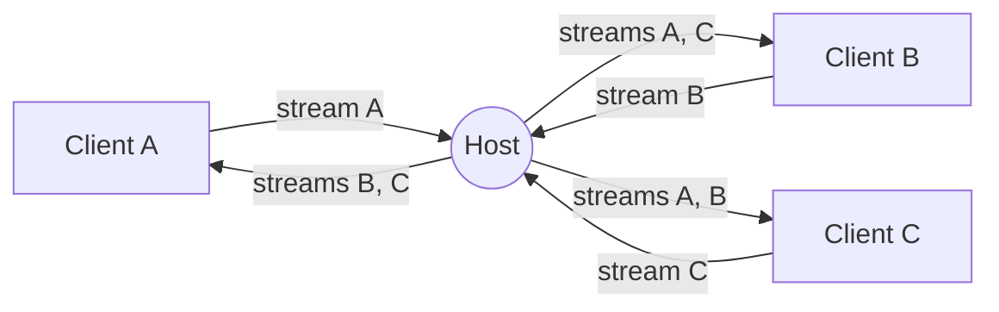

<div align="center">
    <a href="https://www.predatorray.me/rendezvous/" target="_blank"></a>
    <h3><em>donde las conversaciones se encuentran, sin servidores.</em></h3>
</div>

<p align="center">
    Una aplicación web de videoconferencia <b><i>sin servidor</i></b>, al estilo de Zoom,<br>
    construida con React, TypeScript, MUI y PeerJS sobre WebRTC.
</p>

<p align="center">
    <a href="https://discord.gg/VPYRT538n"></a>
    <a href="https://github.com/predatorray/rendezvous/blob/main/LICENSE"></a>
    <a href="https://github.com/predatorray/rendezvous/actions/workflows/ci.yml"></a>
    <a href="https://github.com/predatorray/rendezvous/actions/workflows/publish.yml"></a>
</p>

<p align="center">
    <a href="README.de.md">Deutsch</a> ·
    <a href="README.md">English</a> ·
    <b>Español</b> ·
    <a href="README.fr.md">Français</a> ·
    <a href="README.ja.md">日本語</a> ·
    <a href="README.ko.md">한국어</a> ·
    <a href="README.pt.md">Português</a> ·
    <a href="README.ru.md">Русский</a> ·
    <a href="README.zh.md">中文</a>
</p>

---

👉 **Pruébala en línea: <https://www.predatorray.me/rendezvous/>**

<p align="center">
  
  
</p>

No hay servidor de aplicación: el **anfitrión** de cada reunión actúa como
un nodo de retransmisión para los mensajes de chat y los flujos multimedia,
de modo que cada participante solo mantiene conexiones con el anfitrión en
lugar de con todos los demás participantes. El bróker público de PeerJS se
utiliza únicamente para la señalización inicial de WebRTC.

## Sobre el nombre

*Rendezvous* recibe su nombre del [Rendezvous Lodge](https://www.whistlerblackcomb.com/) en la cima de la montaña Blackcomb, en Whistler Village, el lugar donde el autor se reúne con sus amigos esquiadores.

## Características

- Elige un nombre, organiza una reunión o únete a una existente mediante código o enlace
- Códigos de reunión legibles de 6 letras (~300 millones de combinaciones)
- Cuadrícula de vídeo basada en mosaicos con diseño automático
- El mosaico muestra las iniciales del participante cuando su cámara está apagada
- Silenciar/activar audio, iniciar/detener vídeo (icono de silencio en el mosaico)
- Panel de chat colapsable a la derecha con marcas de tiempo y avisos de entrada/salida
- El anfitrión conserva el historial de chat para que quienes lleguen tarde vean los mensajes anteriores
- Enlace de invitación compartible y código de reunión copiable
- Si el anfitrión se marcha, la reunión termina para todos
- Sin cuentas, sin contraseñas, totalmente desplegable como sitio estático

## Pila tecnológica

- React 19 + TypeScript (Create React App)
- MUI v7 (tema oscuro y minimalista inspirado en Zoom)
- React Router v7 (`HashRouter` para alojamiento estático)
- PeerJS para señalización y orquestación de WebRTC
- `gh-pages` para el despliegue en GitHub Pages

## Ejecución local

```bash
npm install
npm start
```

Abre <http://localhost:3000>. Para probar reuniones con varios participantes,
abre ventanas de incógnito adicionales y usa el mismo código de reunión.

## Compilación

```bash
npm run build
```

Genera un paquete estático en `build/`, listo para servirse desde cualquier
CDN. La aplicación usa `HashRouter`, por lo que funciona en hosts que no
admiten reescrituras de SPA del lado del cliente (p. ej. GitHub Pages).

## Despliegue en GitHub Pages

1. Añade un campo `homepage` a `package.json` que apunte a la URL de tus Pages:

   ```json
   "homepage": "https://YOUR_USER.github.io/rendezvous"
   ```

2. Sube los cambios a GitHub y luego ejecuta:

   ```bash
   npm run deploy
   ```

   Esto compila y sube el directorio `build/` a la rama `gh-pages`
   usando `gh-pages`. Activa Pages desde la rama `gh-pages` en los
   Ajustes del repositorio → Pages.

## Arquitectura

- `src/peer/MeetingClient.ts` — posee el `Peer` de PeerJS e implementa
  tanto el comportamiento de anfitrión (retransmisión) como el de cliente.
- `src/peer/useMeeting.ts` — hook de React que adapta el cliente de
  reunión al estado del componente.
- `src/types.ts` — tipos compartidos y el protocolo de transmisión que
  viaja sobre las `DataConnection` de PeerJS.
- `src/pages/` — páginas de inicio (Home) y de reunión (Meeting).
- `src/components/` — `VideoGrid`, `VideoTile`, `ChatDrawer`,
  `Controls`, `ShareDialog`.

### Protocolo de transmisión

Mensajes intercambiados por la conexión de datos entre un cliente y el
anfitrión:

| Tipo | Dirección | Propósito |
| ---- | --------- | ------- |
| `hello` | cliente → anfitrión | Enviado al conectar con el nombre del participante |
| `welcome` | anfitrión → cliente | Devuelve el id asignado, el roster y la línea de tiempo |
| `roster` | anfitrión → todos | Lista de miembros actualizada (entradas, salidas, estado) |
| `chat-send` | cliente → anfitrión | Borrador de un nuevo mensaje de chat |
| `timeline` | anfitrión → todos | Evento de chat o de sistema autoritativo |
| `state` | cliente → anfitrión | El participante cambió su audio/vídeo |
| `end` | anfitrión → todos | El anfitrión se marcha: la reunión ha terminado |

### Topología multimedia

Cada participante realiza exactamente una llamada multimedia saliente al
anfitrión que transporta su propio flujo. El anfitrión la acepta y:

1. Llama a todos los demás clientes conectados con ese flujo entrante,
   etiquetado con `metadata.peerId` para que el receptor sepa a qué
   participante representa.
2. Envía su propio flujo y todos los flujos remotos existentes a un nuevo
   cliente cuando este se une.

Esto le da a cada cliente un número constante de sesiones de señalización
con el anfitrión (una conexión de datos + N conexiones multimedia),
evitando la clásica malla O(N²).



## Limitaciones / advertencias

- El ancho de banda de subida del anfitrión limita el tamaño de la reunión
  (la retransmisión se ejecuta en una pestaña de navegador de consumo).
- Reenviar las pistas remotas a través del anfitrión las recodifica; la
  calidad se limita a lo que `getUserMedia` y la pila WebRTC del navegador
  negocien.
- Se usa el bróker de PeerJS por defecto; para producción puedes alojar tu
  propio PeerServer y pasarlo al constructor `Peer`.
- La propiedad «sin servidor» solo se mantiene cuando cada participante
  puede establecer una conexión directa entre pares (candidatos de host, o
  candidatos reflexivos de servidor obtenidos mediante STUN para extremos
  detrás de NAT de cono). Si algún participante está detrás de un NAT
  simétrico, ICE no puede negociar una ruta directa, y los datos/multimedia
  se retransmiten a través de un servidor TURN, lo que significa que el
  tráfico es retransmitido por un servidor de terceros en lugar de fluir
  directamente entre los pares.

[1]: https://github.com/predatorray/rendezvous/blob/main/LICENSE
[2]: https://github.com/predatorray/rendezvous/actions/workflows/ci.yml
