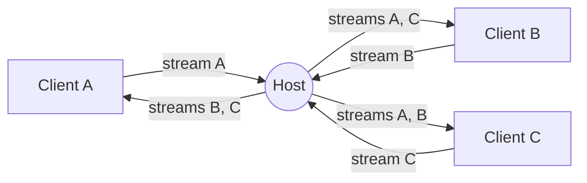

<div align="center">
    <a href="https://www.predatorray.me/rendezvous/" target="_blank"></a>
    <h3><em>là où les conversations se rejoignent, sans serveur.</em></h3>
</div>

<p align="center">
    Une application web de visioconférence <b><i>sans serveur</i></b>, façon Zoom,<br>
    construite avec React, TypeScript, MUI et PeerJS au-dessus de WebRTC.
</p>

<p align="center">
    <a href="https://discord.gg/VPYRT538n"></a>
    <a href="https://github.com/predatorray/rendezvous/blob/main/LICENSE"></a>
    <a href="https://github.com/predatorray/rendezvous/actions/workflows/ci.yml"></a>
    <a href="https://github.com/predatorray/rendezvous/actions/workflows/publish.yml"></a>
</p>

<p align="center">
    <a href="README.de.md">Deutsch</a> ·
    <a href="README.md">English</a> ·
    <a href="README.es.md">Español</a> ·
    <b>Français</b> ·
    <a href="README.ja.md">日本語</a> ·
    <a href="README.ko.md">한국어</a> ·
    <a href="README.pt.md">Português</a> ·
    <a href="README.ru.md">Русский</a> ·
    <a href="README.zh.md">中文</a>
</p>

---

👉 **Essayez-la en ligne : <https://www.predatorray.me/rendezvous/>**

<p align="center">
  
  
</p>

Il n'y a pas de serveur d'application : l'**hôte** de chaque réunion fait
office de nœud relais pour les messages de chat et les flux multimédias,
de sorte que chaque participant ne maintient des connexions qu'avec l'hôte
plutôt qu'avec tous les autres participants. Le broker public de PeerJS
n'est utilisé que pour la signalisation WebRTC initiale.

## À propos du nom

*Rendezvous* tire son nom du [Rendezvous Lodge](https://www.whistlerblackcomb.com/) au sommet du mont Blackcomb à Whistler Village, l'endroit où l'auteur retrouve ses amis skieurs.

## Fonctionnalités

- Choisissez un nom, hébergez une réunion ou rejoignez-en une existante par code ou par lien
- Codes de réunion lisibles de 6 lettres (~300 millions de combinaisons)
- Grille vidéo en mosaïque avec mise en page automatique
- La tuile affiche les initiales du participant lorsque sa caméra est éteinte
- Couper/rétablir l'audio, démarrer/arrêter la vidéo (icône de coupure affichée sur la tuile)
- Panneau de chat repliable sur le côté droit avec horodatages et avis d'arrivée/départ
- L'historique du chat est conservé par l'hôte afin que les retardataires voient les messages précédents
- Lien d'invitation partageable et code de réunion copiable
- Si l'hôte quitte, la réunion se termine pour tout le monde
- Pas de comptes, pas de mots de passe, entièrement déployable en site statique

## Pile technique

- React 19 + TypeScript (Create React App)
- MUI v7 (thème sombre et minimaliste inspiré de Zoom)
- React Router v7 (`HashRouter` pour l'hébergement statique)
- PeerJS pour la signalisation et l'orchestration WebRTC
- `gh-pages` pour le déploiement sur GitHub Pages

## Exécution en local

```bash
npm install
npm start
```

Ouvrez <http://localhost:3000>. Pour tester des réunions à plusieurs,
ouvrez d'autres fenêtres de navigation privée et utilisez le même code de réunion.

## Compilation

```bash
npm run build
```

Génère un bundle statique dans `build/`, prêt à être servi depuis n'importe
quel CDN. L'application utilise `HashRouter`, elle fonctionne donc sur les
hôtes qui ne prennent pas en charge les réécritures SPA côté client (par
exemple GitHub Pages).

## Déploiement sur GitHub Pages

1. Ajoutez un champ `homepage` à `package.json` pointant vers l'URL de vos Pages :

   ```json
   "homepage": "https://YOUR_USER.github.io/rendezvous"
   ```

2. Poussez sur GitHub, puis exécutez :

   ```bash
   npm run deploy
   ```

   Cela compile et pousse le répertoire `build/` vers la branche `gh-pages`
   à l'aide de `gh-pages`. Activez Pages depuis la branche `gh-pages` dans
   les Paramètres du dépôt → Pages.

## Architecture

- `src/peer/MeetingClient.ts` — possède le `Peer` de PeerJS et implémente
  à la fois les comportements d'hôte (relais) et de client.
- `src/peer/useMeeting.ts` — hook React qui adapte le client de réunion à
  l'état des composants.
- `src/types.ts` — types partagés et protocole de transmission véhiculé
  sur les `DataConnection` de PeerJS.
- `src/pages/` — pages Accueil (Home) et Réunion (Meeting).
- `src/components/` — `VideoGrid`, `VideoTile`, `ChatDrawer`,
  `Controls`, `ShareDialog`.

### Protocole de transmission

Messages échangés sur la connexion de données entre un client et l'hôte :

| Type | Direction | Objet |
| ---- | --------- | ------- |
| `hello` | client → hôte | Envoyé à la connexion avec le nom du participant |
| `welcome` | hôte → client | Renvoie l'id attribué, le roster et la timeline |
| `roster` | hôte → tous | Liste des membres mise à jour (arrivées, départs, état) |
| `chat-send` | client → hôte | Brouillon d'un nouveau message de chat |
| `timeline` | hôte → tous | Événement de chat ou système faisant autorité |
| `state` | client → hôte | Le participant a modifié son audio/sa vidéo |
| `end` | hôte → tous | L'hôte s'en va — la réunion est terminée |

### Topologie multimédia

Chaque participant passe exactement un appel multimédia sortant vers
l'hôte transportant son propre flux. L'hôte l'accepte et :

1. Appelle tous les autres clients connectés avec ce flux entrant,
   étiqueté avec `metadata.peerId` afin que le destinataire sache quel
   participant il représente.
2. Envoie son propre flux et tous les flux distants existants à un nouveau
   client lorsqu'il rejoint.

Cela donne à chaque client un nombre constant de sessions de signalisation
avec l'hôte (une connexion de données + N connexions multimédias), évitant
le maillage O(N²) classique.



## Limites / mises en garde

- La bande passante montante de l'hôte limite la taille de la réunion (le
  relais s'exécute dans un onglet de navigateur grand public).
- Le réacheminement des pistes distantes via l'hôte les réencode ; la
  qualité est limitée à ce que `getUserMedia` et la pile WebRTC du
  navigateur négocient.
- Le broker PeerJS par défaut est utilisé ; pour la production, vous pouvez
  héberger votre propre PeerServer et le passer au constructeur `Peer`.
- La propriété « sans serveur » ne tient que lorsque chaque participant
  peut établir une connexion directe de pair à pair (candidats hôtes, ou
  candidats réflexifs de serveur obtenus via STUN pour les points de
  terminaison derrière des NAT de type cône). Si un participant se trouve
  derrière un NAT symétrique, ICE ne peut pas négocier de chemin direct, et
  les données/médias sont relayés via un serveur TURN — ce qui signifie que
  le trafic est acheminé par un serveur tiers au lieu de circuler
  directement entre les pairs.

[1]: https://github.com/predatorray/rendezvous/blob/main/LICENSE
[2]: https://github.com/predatorray/rendezvous/actions/workflows/ci.yml
