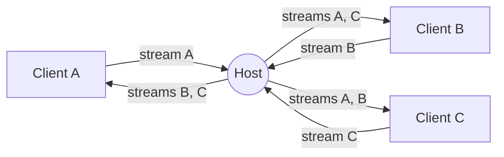

<div align="center">
    <a href="https://www.predatorray.me/rendezvous/" target="_blank"></a>
    <h3><em>会話が出会う場所、サーバーレスに。</em></h3>
</div>

<p align="center">
    React、TypeScript、MUI、そして WebRTC 上の PeerJS で構築された、<br>
    <b><i>サーバーレス</i></b>な Zoom ライクのビデオ会議ウェブアプリ。
</p>

<p align="center">
    <a href="https://discord.gg/VPYRT538n"></a>
    <a href="https://github.com/predatorray/rendezvous/blob/main/LICENSE"></a>
    <a href="https://github.com/predatorray/rendezvous/actions/workflows/ci.yml"></a>
    <a href="https://github.com/predatorray/rendezvous/actions/workflows/publish.yml"></a>
</p>

<p align="center">
    <a href="README.de.md">Deutsch</a> ·
    <a href="README.md">English</a> ·
    <a href="README.es.md">Español</a> ·
    <a href="README.fr.md">Français</a> ·
    <b>日本語</b> ·
    <a href="README.ko.md">한국어</a> ·
    <a href="README.pt.md">Português</a> ·
    <a href="README.ru.md">Русский</a> ·
    <a href="README.zh.md">中文</a>
</p>

---

👉 **オンラインで試す: <https://www.predatorray.me/rendezvous/>**

<p align="center">
  
  
</p>

アプリケーションサーバーは存在しません。各ミーティングの**ホスト**が
チャットメッセージとメディアストリームの中継ハブとして機能するため、
各参加者は他のすべての参加者とではなく、ホストとの接続のみを維持します。
PeerJS の公開ブローカーは、最初の WebRTC シグナリングにのみ使用されます。

## 名前について

*Rendezvous* は、ウィスラービレッジのブラッコム山頂上にある
[Rendezvous Lodge](https://www.whistlerblackcomb.com/) にちなんで名付けられました。
著者がスキー仲間と落ち合う場所です。

## 特長

- 名前を選び、ミーティングをホストするか、コードまたはリンクで既存のミーティングに参加
- 人が読める 6 文字のミーティングコード（約 3 億通りの組み合わせ）
- 自動レイアウトのタイル型ビデオグリッド
- カメラがオフのときはタイルに参加者のイニシャルを表示
- 音声のミュート/解除、ビデオの開始/停止（タイルにミュートアイコンを表示）
- タイムスタンプと入退室通知を備えた折りたたみ可能な右側チャットドロワー
- チャット履歴はホストによって保持され、遅れて参加した人も過去のメッセージを閲覧可能
- 共有可能な招待リンクとコピー可能なミーティングコード
- ホストが退出するとミーティングは全員にとって終了
- アカウント不要、パスコード不要、完全に静的サイトとしてデプロイ可能

## 技術スタック

- React 19 + TypeScript（Create React App）
- MUI v7（Zoom にインスパイアされたダークでミニマルなテーマ）
- React Router v7（静的ホスティング向けの `HashRouter`）
- シグナリングと WebRTC オーケストレーションのための PeerJS
- GitHub Pages へのデプロイ用の `gh-pages`

## ローカルで実行する

```bash
npm install
npm start
```

<http://localhost:3000> を開きます。複数人のミーティングをテストするには、
追加のシークレットウィンドウを開き、同じミーティングコードを使用します。

## ビルド

```bash
npm run build
```

`build/` に静的バンドルを出力し、任意の CDN から配信できる状態になります。
このアプリは `HashRouter` を使用しているため、クライアントサイドの SPA
リライトをサポートしないホスト（例: GitHub Pages）でも動作します。

## GitHub Pages へのデプロイ

1. `package.json` に Pages の URL を指す `homepage` フィールドを追加します:

   ```json
   "homepage": "https://YOUR_USER.github.io/rendezvous"
   ```

2. GitHub にプッシュしてから、次を実行します:

   ```bash
   npm run deploy
   ```

   これにより `gh-pages` を使ってビルドが行われ、`build/` ディレクトリが
   `gh-pages` ブランチにプッシュされます。リポジトリの設定 → Pages で
   `gh-pages` ブランチから Pages を有効にしてください。

## アーキテクチャ

- `src/peer/MeetingClient.ts` — PeerJS の `Peer` を保持し、ホスト（中継）
  とクライアントの両方の動作を実装します。
- `src/peer/useMeeting.ts` — ミーティングクライアントをコンポーネントの
  状態に適合させる React フック。
- `src/types.ts` — 共有される型と、PeerJS の `DataConnection` 上で運ばれる
  ワイヤープロトコル。
- `src/pages/` — ホームページとミーティングページ。
- `src/components/` — `VideoGrid`、`VideoTile`、`ChatDrawer`、
  `Controls`、`ShareDialog`。

### ワイヤープロトコル

クライアントとホストの間のデータ接続でやり取りされるメッセージ:

| 種類 | 方向 | 目的 |
| ---- | --------- | ------- |
| `hello` | クライアント → ホスト | 接続時に参加者の名前とともに送信 |
| `welcome` | ホスト → クライアント | 割り当てられた id、名簿、タイムラインを返す |
| `roster` | ホスト → 全員 | 更新されたメンバー一覧（参加、退出、状態） |
| `chat-send` | クライアント → ホスト | 新しいチャットメッセージの下書き |
| `timeline` | ホスト → 全員 | 権威あるチャットまたはシステムイベント |
| `state` | クライアント → ホスト | 参加者が音声/ビデオを変更した |
| `end` | ホスト → 全員 | ホストが退出 — ミーティングは終了 |

### メディアトポロジー

各参加者は自分自身のストリームを運ぶ発信メディアコールをホストにちょうど
1 つ行います。ホストはそれを受け入れ、次を行います:

1. その受信ストリームを、`metadata.peerId` でタグ付けして他のすべての接続中
   クライアントに発信します。これにより受信側はどの参加者を表すかを把握できます。
2. 新しいクライアントが参加したとき、自分自身のストリームと既存のすべての
   リモートストリームをそのクライアントに送ります。

これにより各クライアントはホストとの間で一定数のシグナリングセッション
（1 つのデータ接続 + N 個のメディア接続）を持つことになり、古典的な O(N²)
メッシュを回避します。



## 制限事項・注意点

- ホストのアップストリーム帯域幅がミーティングの規模を制限します（中継は
  コンシューマー向けのブラウザタブ上で動作します）。
- リモートトラックをホスト経由で転送すると再エンコードが行われ、品質は
  `getUserMedia` とブラウザの WebRTC スタックがネゴシエートする範囲に
  制限されます。
- デフォルトの PeerJS ブローカーが使われます。本番環境では独自の
  PeerServer をホストし、`Peer` コンストラクタに渡すことができます。
- 「サーバーレス」という性質は、すべての参加者が直接のピアツーピア接続
  （ホスト候補、またはコーン NAT の背後にあるエンドポイント向けに STUN で
  取得されるサーバーリフレクシブ候補）を確立できる場合にのみ成り立ちます。
  いずれかの参加者が対称型 NAT の背後にいる場合、ICE は直接経路を
  ネゴシエートできず、メディア/データは TURN サーバーを介して中継されます。
  つまり、トラフィックはピア間で直接流れるのではなく、サードパーティの
  サーバーによってプロキシされることになります。

[1]: https://github.com/predatorray/rendezvous/blob/main/LICENSE
[2]: https://github.com/predatorray/rendezvous/actions/workflows/ci.yml
