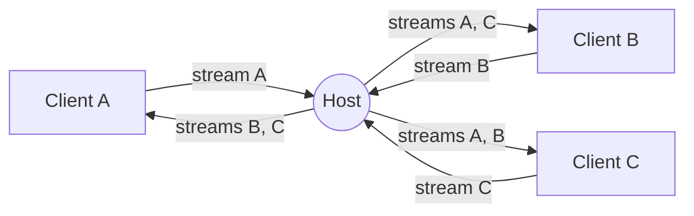

<div align="center">
    <a href="https://www.predatorray.me/rendezvous/" target="_blank"></a>
    <h3><em>대화가 만나는 곳, 서버 없이.</em></h3>
</div>

<p align="center">
    React, TypeScript, MUI, 그리고 WebRTC 위의 PeerJS로 만든<br>
    <b><i>서버리스</i></b> Zoom 스타일 화상 회의 웹 앱.
</p>

<p align="center">
    <a href="https://discord.gg/VPYRT538n"></a>
    <a href="https://github.com/predatorray/rendezvous/blob/main/LICENSE"></a>
    <a href="https://github.com/predatorray/rendezvous/actions/workflows/ci.yml"></a>
    <a href="https://github.com/predatorray/rendezvous/actions/workflows/publish.yml"></a>
</p>

<p align="center">
    <a href="README.de.md">Deutsch</a> ·
    <a href="README.md">English</a> ·
    <a href="README.es.md">Español</a> ·
    <a href="README.fr.md">Français</a> ·
    <a href="README.ja.md">日本語</a> ·
    <b>한국어</b> ·
    <a href="README.pt.md">Português</a> ·
    <a href="README.ru.md">Русский</a> ·
    <a href="README.zh.md">中文</a>
</p>

---

👉 **온라인에서 사용해 보기: <https://www.predatorray.me/rendezvous/>**

<p align="center">
  
  
</p>

애플리케이션 서버가 없습니다. 각 회의의 **호스트**가 채팅 메시지와 미디어
스트림의 중계 허브 역할을 하므로, 각 참가자는 다른 모든 참가자가 아니라
호스트와의 연결만 유지합니다. PeerJS 공개 브로커는 초기 WebRTC 시그널링에만
사용됩니다.

## 이름에 대하여

*Rendezvous*는 휘슬러 빌리지의 블랙콤 산 정상에 있는
[Rendezvous Lodge](https://www.whistlerblackcomb.com/)에서 이름을 따왔습니다.
저자가 스키 친구들과 만나는 장소입니다.

## 기능

- 이름을 정하고, 회의를 호스팅하거나, 코드 또는 링크로 기존 회의에 참가
- 사람이 읽기 쉬운 6자 회의 코드(약 3억 개 조합)
- 자동 레이아웃 기반의 타일형 비디오 그리드
- 카메라가 꺼져 있으면 타일에 참가자의 이니셜 표시
- 오디오 음소거/해제, 비디오 시작/정지(타일에 음소거 아이콘 표시)
- 타임스탬프와 입장/퇴장 알림이 있는 접을 수 있는 오른쪽 채팅 서랍
- 채팅 기록은 호스트가 보존하여 늦게 참가한 사람도 이전 메시지를 확인 가능
- 공유 가능한 초대 링크와 복사 가능한 회의 코드
- 호스트가 나가면 모두에게 회의가 종료됨
- 계정 불필요, 비밀번호 불필요, 완전한 정적 사이트로 배포 가능

## 기술 스택

- React 19 + TypeScript (Create React App)
- MUI v7 (Zoom에서 영감을 받은 다크하고 미니멀한 테마)
- React Router v7 (정적 호스팅용 `HashRouter`)
- 시그널링과 WebRTC 오케스트레이션을 위한 PeerJS
- GitHub Pages 배포를 위한 `gh-pages`

## 로컬에서 실행하기

```bash
npm install
npm start
```

<http://localhost:3000>을 엽니다. 다자간 회의를 테스트하려면 추가
시크릿 창을 열고 동일한 회의 코드를 사용하세요.

## 빌드

```bash
npm run build
```

어떤 CDN에서도 제공할 수 있는 정적 번들을 `build/`에 출력합니다. 이 앱은
`HashRouter`를 사용하므로 클라이언트 측 SPA 리라이트를 지원하지 않는
호스트(예: GitHub Pages)에서도 작동합니다.

## GitHub Pages에 배포하기

1. `package.json`에 Pages URL을 가리키는 `homepage` 필드를 추가합니다:

   ```json
   "homepage": "https://YOUR_USER.github.io/rendezvous"
   ```

2. GitHub에 푸시한 다음 실행합니다:

   ```bash
   npm run deploy
   ```

   이렇게 하면 `gh-pages`를 사용해 빌드한 뒤 `build/` 디렉터리를 `gh-pages`
   브랜치에 푸시합니다. 저장소 설정 → Pages에서 `gh-pages` 브랜치로부터
   Pages를 활성화하세요.

## 아키텍처

- `src/peer/MeetingClient.ts` — PeerJS `Peer`를 소유하며 호스트(중계)와
  클라이언트 동작을 모두 구현합니다.
- `src/peer/useMeeting.ts` — 회의 클라이언트를 컴포넌트 상태에 맞추는
  React 훅.
- `src/types.ts` — 공유 타입과 PeerJS `DataConnection`을 통해 전달되는
  와이어 프로토콜.
- `src/pages/` — 홈(Home)과 회의(Meeting) 페이지.
- `src/components/` — `VideoGrid`, `VideoTile`, `ChatDrawer`,
  `Controls`, `ShareDialog`.

### 와이어 프로토콜

클라이언트와 호스트 사이의 데이터 연결에서 교환되는 메시지:

| 유형 | 방향 | 목적 |
| ---- | --------- | ------- |
| `hello` | 클라이언트 → 호스트 | 연결 시 참가자의 이름과 함께 전송 |
| `welcome` | 호스트 → 클라이언트 | 할당된 id, 명단, 타임라인을 반환 |
| `roster` | 호스트 → 전체 | 갱신된 멤버 목록(입장, 퇴장, 상태) |
| `chat-send` | 클라이언트 → 호스트 | 새 채팅 메시지 초안 |
| `timeline` | 호스트 → 전체 | 권위 있는 채팅 또는 시스템 이벤트 |
| `state` | 클라이언트 → 호스트 | 참가자가 오디오/비디오를 변경함 |
| `end` | 호스트 → 전체 | 호스트가 나감 — 회의가 종료됨 |

### 미디어 토폴로지

각 참가자는 자신의 스트림을 전달하는 단 하나의 발신 미디어 호출을
호스트에게 보냅니다. 호스트는 이를 수락하고 다음을 수행합니다:

1. 들어온 그 스트림을 `metadata.peerId`로 태그하여 연결된 다른 모든
   클라이언트에게 호출합니다. 이를 통해 수신자는 어떤 참가자를 나타내는지
   알 수 있습니다.
2. 새 클라이언트가 참가하면 자신의 스트림과 기존의 모든 원격 스트림을
   그 클라이언트에게 전달합니다.

이렇게 하면 각 클라이언트는 호스트와 일정한 수의 시그널링 세션(데이터
연결 1개 + 미디어 연결 N개)을 갖게 되어, 전형적인 O(N²) 메시를 피합니다.



## 제한 사항 / 주의점

- 호스트의 업스트림 대역폭이 회의 규모를 제한합니다(중계는 소비자용
  브라우저 탭에서 실행됩니다).
- 원격 트랙을 호스트를 통해 전달하면 재인코딩되므로, 품질은 `getUserMedia`와
  브라우저의 WebRTC 스택이 협상하는 범위로 제한됩니다.
- 기본 PeerJS 브로커가 사용됩니다. 프로덕션에서는 자체 PeerServer를
  호스팅하여 `Peer` 생성자에 전달할 수 있습니다.
- "서버리스" 속성은 모든 참가자가 직접적인 피어 투 피어 연결(호스트
  후보, 또는 콘 NAT 뒤의 엔드포인트를 위해 STUN으로 얻은 서버 리플렉시브
  후보)을 수립할 수 있을 때만 성립합니다. 어떤 참가자라도 대칭형 NAT 뒤에
  있으면 ICE가 직접 경로를 협상할 수 없으며, 미디어/데이터는 TURN 서버를
  통해 중계됩니다. 즉, 트래픽이 피어 간에 직접 흐르지 않고 제3자 서버에
  의해 프록시된다는 뜻입니다.

[1]: https://github.com/predatorray/rendezvous/blob/main/LICENSE
[2]: https://github.com/predatorray/rendezvous/actions/workflows/ci.yml
