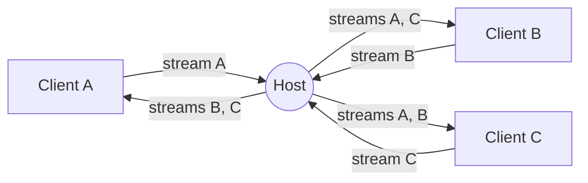

<div align="center">
    <a href="https://www.predatorray.me/rendezvous/" target="_blank"></a>
    <h3><em>where conversations meet, serverlessly.</em></h3>
</div>

<p align="center">
    A <b><i>serverless</i></b>, Zoom-like video conferencing web app,<br>
    built with React, TypeScript, MUI, and PeerJS on top of WebRTC.
</p>

<p align="center">
    <a href="https://discord.gg/VPYRT538n"></a>
    <a href="https://github.com/predatorray/rendezvous/blob/main/LICENSE"></a>
    <a href="https://github.com/predatorray/rendezvous/actions/workflows/ci.yml"></a>
    <a href="https://github.com/predatorray/rendezvous/actions/workflows/publish.yml"></a>
</p>

<p align="center">
    <a href="README.de.md">Deutsch</a> ·
    <b>English</b> ·
    <a href="README.es.md">Español</a> ·
    <a href="README.fr.md">Français</a> ·
    <a href="README.ja.md">日本語</a> ·
    <a href="README.ko.md">한국어</a> ·
    <a href="README.pt.md">Português</a> ·
    <a href="README.ru.md">Русский</a> ·
    <a href="README.zh.md">中文</a>
</p>

---

👉 **Try it online: <https://www.predatorray.me/rendezvous/>**

<p align="center">
  
  
</p>

There is no application server — the **host** of each meeting acts as a
relay hub for chat messages and media streams, so each participant only
maintains connections to the host instead of every other participant. The
PeerJS public broker is used only for the initial WebRTC signaling.

## About the name

*Rendezvous* is named after the [Rendezvous Lodge](https://www.whistlerblackcomb.com/) atop Blackcomb Mountain in Whistler Village — the spot where the author meets up with skier friends.

## Features

- Pick a name, host a meeting, or join an existing one by code or link
- 6-letter human-readable meeting codes (~300M combinations)
- Tile-based video grid with auto-layout
- Tile shows the participant’s initials when their camera is off
- Mute / unmute audio, start / stop video (mute icon shown on the tile)
- Collapsible right-side chat drawer with timestamps and join/leave notices
- Chat history is preserved by the host so late joiners see prior messages
- Sharable invite link and copy-able meeting code
- Host leaving ends the meeting for everyone
- Opening a meeting before its host arrives shows a **waiting room** and joins
  automatically once a host is live; if nobody is hosting, you can host it
  yourself — so a host can leave and re-host from the same invite link
- **Verified meetings (experimental)** — host proves their identity with a
  passkey so guests can’t be fooled by an impostor ([details](#verified-meetings-experimental))
- No accounts, no passcodes, fully static-site deployable

## Verified meetings (experimental)

A meeting code proves nothing about *who* is hosting: the host’s PeerJS id is
derived from the code (`rendezvous-<code>`), so anyone who knows the code can
race to claim that id on the public broker and relay the meeting as a fake
"host". Verified meetings let a host prove their identity to guests with a
**passkey** (WebAuthn), so guests can refuse to join an impostor.

It’s **off by default**. Flip the *Verified meeting* switch on the home page
(host side only); guests need nothing — verification kicks in automatically
when they open a verified link.

How it works, briefly:

- The host identity is a passkey; its public key (and a `SHA256:…` fingerprint)
  is carried in the invite URL. The private key never leaves the authenticator
  and syncs across the host’s devices via iCloud Keychain / Google Password
  Manager.
- The passkey signs an ephemeral session key **once per meeting** (a single
  biometric prompt); that session key then signs each guest’s fresh nonce, so
  there’s no prompt per guest.
- A guest verifies three things before sending any data: the identity key
  matches the URL fingerprint, the passkey vouches for the session key, and the
  session key signed *this guest’s* nonce. If any check fails it refuses to
  join.
- Both sides can open a **Host identity** dialog to compare the fingerprint
  out-of-band (SSH-style) — the only thing that catches a *tampered* invite
  link, since the crypto otherwise trusts whatever key is in the URL.
- Guests opening a verified link before the host is present see a **waiting
  room** and join automatically once the host appears.
- The invite link a host shares is the *guest* link (no `host=1`). When the
  real host opens it for an unhosted meeting, the waiting room offers **“Host
  this meeting”** — claiming it with the passkey starts hosting. This is what
  lets a host create a link ahead of time (or leave and come back) and still
  host it, rather than being stuck as a guest.

This delivers host **authentication** (it stops peer-id squatters and
impostors), not yet a fully app-layer-authenticated channel — an active relay
MITM is a deliberate follow-up. See
[`docs/verified-meetings.md`](docs/verified-meetings.md) for the full protocol,
threat model, and limitations.

## Tech stack

- React 19 + TypeScript (Create React App)
- MUI v7 (dark, minimalist Zoom-inspired theme)
- React Router v7 (`HashRouter` for static hosting)
- PeerJS for signaling and WebRTC orchestration
- `gh-pages` for GitHub Pages deployment

## Running locally

```bash
npm install
npm start
```

Open <http://localhost:3000>. To test multi-party meetings open additional
incognito windows and use the same meeting code.

## Building

```bash
npm run build
```

Outputs a static bundle in `build/` ready to be served from any CDN. The
app uses `HashRouter`, so it works on hosts that don’t support
client-side SPA rewrites (e.g. GitHub Pages).

## Deploying to GitHub Pages

1. Add a `homepage` field to `package.json` pointing at your Pages URL:

   ```json
   "homepage": "https://YOUR_USER.github.io/rendezvous"
   ```

2. Push to GitHub, then run:

   ```bash
   npm run deploy
   ```

   This builds and pushes the `build/` directory to the `gh-pages` branch
   using `gh-pages`. Enable Pages from the `gh-pages` branch in repo
   Settings → Pages.

## Architecture

- `src/peer/MeetingClient.ts` — owns the PeerJS `Peer` and implements
  both host (relay) and client behaviors.
- `src/peer/useMeeting.ts` — React hook that adapts the meeting client
  to component state.
- `src/types.ts` — shared types and the wire protocol carried over
  PeerJS `DataConnection`s.
- `src/pages/` — Home and Meeting pages.
- `src/components/` — `VideoGrid`, `VideoTile`, `ChatDrawer`,
  `Controls`, `ShareDialog`.
- `src/crypto/` — verified-meeting primitives (base64url/SHA-256, WebAuthn
  assertion & signature verification, fingerprints).
- `src/peer/hostIdentity.ts` + `src/peer/verification.ts` — the passkey
  identity and the verified-meeting handshake (see
  [`docs/verified-meetings.md`](docs/verified-meetings.md)).

### Wire protocol

Messages exchanged over the data connection between a client and the
host:

| Type | Direction | Purpose |
| ---- | --------- | ------- |
| `hello` | client → host | Sent on connect with the participant’s name |
| `welcome` | host → client | Returns assigned id, roster, and timeline |
| `roster` | host → all | Updated member list (joins, leaves, state) |
| `chat-send` | client → host | New chat message draft |
| `timeline` | host → all | Authoritative chat or system event |
| `state` | client → host | Participant changed audio/video |
| `end` | host → all | Host is leaving — meeting is over |
| `auth-challenge` | client → host | Verified meetings: guest’s fresh nonce |
| `auth-response` | host → client | Verified meetings: identity key + session cert + nonce signature |
| `auth-unavailable` | host → client | Verified meetings: responder isn’t running verification |

### Media topology

Each participant places exactly one outbound media call to the host
carrying their own stream. The host accepts and:

1. Calls every other connected client with that incoming stream,
   tagged with `metadata.peerId` so the receiver knows which participant
   it represents.
2. Pushes its own stream and every existing remote stream to a new
   client when they join.

This gives every client a constant number of signalling sessions with
the host (one data connection + N media connections), avoiding the
classic O(N²) mesh.



## Limitations / caveats

- The host’s upstream bandwidth bounds meeting size (relay is on a
  consumer-grade browser tab).
- Forwarding remote tracks through the host re-encodes them; quality is
  limited to what `getUserMedia` and the browser’s WebRTC stack negotiate.
- Default PeerJS broker is used; for production you can host your own
  PeerServer and pass it to the `Peer` constructor.
- The "serverless" property only holds when every participant can establish
  a direct peer-to-peer connection (host candidates, or server-reflexive
  candidates obtained via STUN for endpoints behind cone NATs). If any
  participant sits behind a symmetric NAT, ICE cannot negotiate a direct
  path, and media/data are relayed through a TURN server — meaning that
  traffic is proxied by a third-party server rather than flowing directly
  between peers.
- Verified meetings provide host **authentication**, not a fully
  app-layer-authenticated channel: an active relay MITM that intercepts the
  guest *and* connects to the real host is out of scope for this experimental
  cut. Passkeys are also pinned to the origin domain (the WebAuthn RP id), so a
  verified identity created on `www.example.com` won’t validate on a bare
  `example.com` — keep the canonical host consistent. See
  [`docs/verified-meetings.md`](docs/verified-meetings.md).
- The public PeerJS broker doesn’t release a departed host’s peer id
  immediately, so re-hosting the *same* code seconds after leaving can briefly
  fail (re-hosting retries for a short grace window). Coming back later, or
  running your own PeerServer, avoids this.

[1]: https://github.com/predatorray/rendezvous/blob/main/LICENSE
[2]: https://github.com/predatorray/rendezvous/actions/workflows/ci.yml
