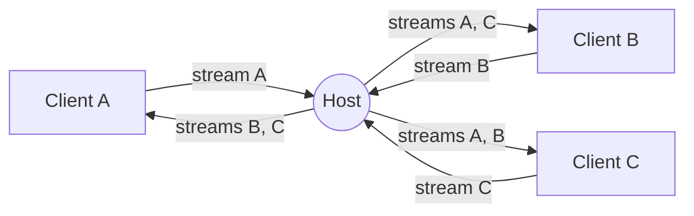

<div align="center">
    <a href="https://www.predatorray.me/rendezvous/" target="_blank"></a>
    <h3><em>onde as conversas se encontram, sem servidor.</em></h3>
</div>

<p align="center">
    Um aplicativo web de videoconferência <b><i>sem servidor</i></b>, estilo Zoom,<br>
    construído com React, TypeScript, MUI e PeerJS sobre WebRTC.
</p>

<p align="center">
    <a href="https://discord.gg/VPYRT538n"></a>
    <a href="https://github.com/predatorray/rendezvous/blob/main/LICENSE"></a>
    <a href="https://github.com/predatorray/rendezvous/actions/workflows/ci.yml"></a>
    <a href="https://github.com/predatorray/rendezvous/actions/workflows/publish.yml"></a>
</p>

<p align="center">
    <a href="README.de.md">Deutsch</a> ·
    <a href="README.md">English</a> ·
    <a href="README.es.md">Español</a> ·
    <a href="README.fr.md">Français</a> ·
    <a href="README.ja.md">日本語</a> ·
    <a href="README.ko.md">한국어</a> ·
    <b>Português</b> ·
    <a href="README.ru.md">Русский</a> ·
    <a href="README.zh.md">中文</a>
</p>

---

👉 **Experimente online: <https://www.predatorray.me/rendezvous/>**

<p align="center">
  
  
</p>

Não há servidor de aplicação — o **anfitrião** de cada reunião atua como um
nó de retransmissão para mensagens de chat e fluxos de mídia, de modo que
cada participante mantém conexões apenas com o anfitrião, em vez de com
todos os outros participantes. O broker público do PeerJS é usado apenas
para a sinalização WebRTC inicial.

## Sobre o nome

*Rendezvous* leva o nome do [Rendezvous Lodge](https://www.whistlerblackcomb.com/) no topo da montanha Blackcomb, em Whistler Village — o lugar onde o autor encontra seus amigos esquiadores.

## Funcionalidades

- Escolha um nome, hospede uma reunião ou entre em uma existente por código ou link
- Códigos de reunião legíveis de 6 letras (~300 milhões de combinações)
- Grade de vídeo baseada em blocos com layout automático
- O bloco mostra as iniciais do participante quando sua câmera está desligada
- Silenciar/reativar áudio, iniciar/parar vídeo (ícone de mudo exibido no bloco)
- Painel de chat retrátil no lado direito com marcações de horário e avisos de entrada/saída
- O histórico de chat é preservado pelo anfitrião para que quem chega atrasado veja as mensagens anteriores
- Link de convite compartilhável e código de reunião copiável
- Se o anfitrião sair, a reunião termina para todos
- Sem contas, sem senhas, totalmente implantável como site estático

## Pilha tecnológica

- React 19 + TypeScript (Create React App)
- MUI v7 (tema escuro e minimalista inspirado no Zoom)
- React Router v7 (`HashRouter` para hospedagem estática)
- PeerJS para sinalização e orquestração de WebRTC
- `gh-pages` para implantação no GitHub Pages

## Executando localmente

```bash
npm install
npm start
```

Abra <http://localhost:3000>. Para testar reuniões com vários participantes,
abra janelas anônimas adicionais e use o mesmo código de reunião.

## Compilando

```bash
npm run build
```

Gera um pacote estático em `build/`, pronto para ser servido a partir de
qualquer CDN. O app usa `HashRouter`, portanto funciona em hosts que não
oferecem suporte a reescritas de SPA do lado do cliente (por exemplo, GitHub Pages).

## Implantando no GitHub Pages

1. Adicione um campo `homepage` ao `package.json` apontando para a URL das suas Pages:

   ```json
   "homepage": "https://YOUR_USER.github.io/rendezvous"
   ```

2. Faça push para o GitHub e, em seguida, execute:

   ```bash
   npm run deploy
   ```

   Isso compila e envia o diretório `build/` para o branch `gh-pages`
   usando `gh-pages`. Ative o Pages a partir do branch `gh-pages` nas
   Configurações do repositório → Pages.

## Arquitetura

- `src/peer/MeetingClient.ts` — possui o `Peer` do PeerJS e implementa
  tanto o comportamento de anfitrião (retransmissão) quanto o de cliente.
- `src/peer/useMeeting.ts` — hook React que adapta o cliente de reunião ao
  estado do componente.
- `src/types.ts` — tipos compartilhados e o protocolo de transmissão levado
  pelas `DataConnection` do PeerJS.
- `src/pages/` — páginas Início (Home) e Reunião (Meeting).
- `src/components/` — `VideoGrid`, `VideoTile`, `ChatDrawer`,
  `Controls`, `ShareDialog`.

### Protocolo de transmissão

Mensagens trocadas pela conexão de dados entre um cliente e o anfitrião:

| Tipo | Direção | Finalidade |
| ---- | --------- | ------- |
| `hello` | cliente → anfitrião | Enviado ao conectar com o nome do participante |
| `welcome` | anfitrião → cliente | Retorna o id atribuído, o roster e a linha do tempo |
| `roster` | anfitrião → todos | Lista de membros atualizada (entradas, saídas, estado) |
| `chat-send` | cliente → anfitrião | Rascunho de nova mensagem de chat |
| `timeline` | anfitrião → todos | Evento de chat ou de sistema autoritativo |
| `state` | cliente → anfitrião | O participante alterou áudio/vídeo |
| `end` | anfitrião → todos | O anfitrião está saindo — a reunião acabou |

### Topologia de mídia

Cada participante faz exatamente uma chamada de mídia de saída para o
anfitrião, transportando seu próprio fluxo. O anfitrião a aceita e:

1. Liga para todos os outros clientes conectados com esse fluxo recebido,
   marcado com `metadata.peerId` para que o receptor saiba qual
   participante ele representa.
2. Envia seu próprio fluxo e todos os fluxos remotos existentes para um
   novo cliente quando ele entra.

Isso dá a cada cliente um número constante de sessões de sinalização com o
anfitrião (uma conexão de dados + N conexões de mídia), evitando a clássica
malha O(N²).



## Limitações / ressalvas

- A largura de banda de upload do anfitrião limita o tamanho da reunião (a
  retransmissão roda em uma aba de navegador de consumo).
- Encaminhar trilhas remotas pelo anfitrião as recodifica; a qualidade fica
  limitada ao que o `getUserMedia` e a pilha WebRTC do navegador negociam.
- O broker padrão do PeerJS é usado; para produção, você pode hospedar seu
  próprio PeerServer e passá-lo ao construtor `Peer`.
- A propriedade "sem servidor" só se mantém quando cada participante
  consegue estabelecer uma conexão direta ponto a ponto (candidatos de
  host, ou candidatos servidor-reflexivos obtidos via STUN para extremidades
  atrás de NATs do tipo cone). Se algum participante estiver atrás de um NAT
  simétrico, o ICE não consegue negociar um caminho direto, e mídia/dados
  são retransmitidos por um servidor TURN — ou seja, o tráfego é
  intermediado por um servidor de terceiros em vez de fluir diretamente
  entre os pares.

[1]: https://github.com/predatorray/rendezvous/blob/main/LICENSE
[2]: https://github.com/predatorray/rendezvous/actions/workflows/ci.yml
