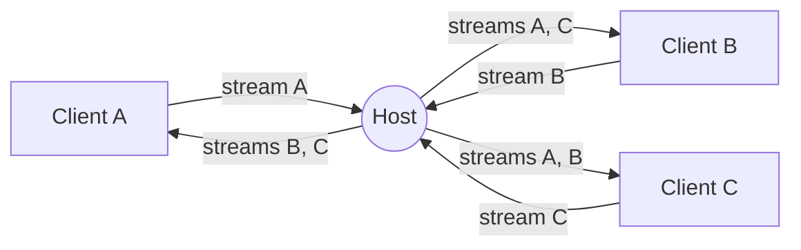

<div align="center">
    <a href="https://www.predatorray.me/rendezvous/" target="_blank"></a>
    <h3><em>где встречаются разговоры — без сервера.</em></h3>
</div>

<p align="center">
    <b><i>Бессерверное</i></b> веб-приложение для видеоконференций в стиле Zoom,<br>
    построенное на React, TypeScript, MUI и PeerJS поверх WebRTC.
</p>

<p align="center">
    <a href="https://discord.gg/VPYRT538n"></a>
    <a href="https://github.com/predatorray/rendezvous/blob/main/LICENSE"></a>
    <a href="https://github.com/predatorray/rendezvous/actions/workflows/ci.yml"></a>
    <a href="https://github.com/predatorray/rendezvous/actions/workflows/publish.yml"></a>
</p>

<p align="center">
    <a href="README.de.md">Deutsch</a> ·
    <a href="README.md">English</a> ·
    <a href="README.es.md">Español</a> ·
    <a href="README.fr.md">Français</a> ·
    <a href="README.ja.md">日本語</a> ·
    <a href="README.ko.md">한국어</a> ·
    <a href="README.pt.md">Português</a> ·
    <b>Русский</b> ·
    <a href="README.zh.md">中文</a>
</p>

---

👉 **Попробовать онлайн: <https://www.predatorray.me/rendezvous/>**

<p align="center">
  
  
</p>

Сервера приложений нет — **хост** каждой встречи выступает в роли узла
ретрансляции для сообщений чата и медиапотоков, поэтому каждый участник
поддерживает соединения только с хостом, а не с каждым другим участником.
Публичный брокер PeerJS используется только для начальной WebRTC-сигнализации.

## О названии

*Rendezvous* назван в честь [Rendezvous Lodge](https://www.whistlerblackcomb.com/) на вершине горы Блэккомб в Уистлер-Виллидж — места, где автор встречается со своими друзьями-лыжниками.

## Возможности

- Выберите имя, создайте встречу или присоединитесь к существующей по коду или ссылке
- Удобочитаемые коды встреч из 6 букв (~300 млн комбинаций)
- Плиточная видеосетка с автоматической компоновкой
- Когда камера выключена, на плитке показываются инициалы участника
- Включение/отключение звука, запуск/остановка видео (значок отключённого звука на плитке)
- Сворачиваемая правая панель чата с метками времени и уведомлениями о входе/выходе
- История чата сохраняется хостом, чтобы опоздавшие видели предыдущие сообщения
- Ссылка-приглашение для отправки и копируемый код встречи
- Если хост уходит, встреча завершается для всех
- Без учётных записей, без паролей, полностью разворачивается как статический сайт

## Технологический стек

- React 19 + TypeScript (Create React App)
- MUI v7 (тёмная минималистичная тема в стиле Zoom)
- React Router v7 (`HashRouter` для статического хостинга)
- PeerJS для сигнализации и оркестрации WebRTC
- `gh-pages` для развёртывания на GitHub Pages

## Запуск локально

```bash
npm install
npm start
```

Откройте <http://localhost:3000>. Чтобы протестировать встречи с несколькими
участниками, откройте дополнительные окна в режиме инкогнито и используйте
тот же код встречи.

## Сборка

```bash
npm run build
```

Создаёт статический бандл в `build/`, готовый к раздаче с любого CDN.
Приложение использует `HashRouter`, поэтому работает на хостингах, не
поддерживающих клиентские SPA-перезаписи (например, GitHub Pages).

## Развёртывание на GitHub Pages

1. Добавьте в `package.json` поле `homepage`, указывающее на URL ваших Pages:

   ```json
   "homepage": "https://YOUR_USER.github.io/rendezvous"
   ```

2. Отправьте изменения в GitHub, затем выполните:

   ```bash
   npm run deploy
   ```

   Это собирает и отправляет каталог `build/` в ветку `gh-pages` с помощью
   `gh-pages`. Включите Pages из ветки `gh-pages` в настройках репозитория
   → Pages.

## Архитектура

- `src/peer/MeetingClient.ts` — владеет объектом `Peer` из PeerJS и
  реализует поведение как хоста (ретрансляции), так и клиента.
- `src/peer/useMeeting.ts` — React-хук, адаптирующий клиент встречи к
  состоянию компонентов.
- `src/types.ts` — общие типы и протокол передачи, переносимый по
  `DataConnection` из PeerJS.
- `src/pages/` — страницы «Главная» (Home) и «Встреча» (Meeting).
- `src/components/` — `VideoGrid`, `VideoTile`, `ChatDrawer`,
  `Controls`, `ShareDialog`.

### Протокол передачи

Сообщения, которыми обмениваются клиент и хост по соединению данных:

| Тип | Направление | Назначение |
| ---- | --------- | ------- |
| `hello` | клиент → хост | Отправляется при подключении с именем участника |
| `welcome` | хост → клиент | Возвращает назначенный id, список участников и таймлайн |
| `roster` | хост → всем | Обновлённый список участников (входы, выходы, состояние) |
| `chat-send` | клиент → хост | Черновик нового сообщения чата |
| `timeline` | хост → всем | Авторитетное событие чата или системы |
| `state` | клиент → хост | Участник изменил аудио/видео |
| `end` | хост → всем | Хост уходит — встреча завершена |

### Медиатопология

Каждый участник устанавливает ровно один исходящий медиавызов к хосту,
передающий его собственный поток. Хост принимает его и:

1. Вызывает каждого другого подключённого клиента с этим входящим потоком,
   помеченным `metadata.peerId`, чтобы получатель знал, какого участника он
   представляет.
2. Отправляет свой собственный поток и все существующие удалённые потоки
   новому клиенту, когда тот присоединяется.

Это обеспечивает каждому клиенту постоянное число сигнальных сессий с
хостом (одно соединение данных + N медиасоединений), избегая классической
сетки O(N²).



## Ограничения / оговорки

- Исходящая полоса пропускания хоста ограничивает размер встречи
  (ретрансляция выполняется во вкладке потребительского браузера).
- Пересылка удалённых дорожек через хост приводит к их перекодированию;
  качество ограничено тем, что согласуют `getUserMedia` и WebRTC-стек
  браузера.
- По умолчанию используется брокер PeerJS; для продакшена вы можете
  развернуть собственный PeerServer и передать его в конструктор `Peer`.
- Свойство «бессерверности» сохраняется только тогда, когда каждый участник
  может установить прямое одноранговое соединение (кандидаты хоста или
  серверно-рефлексивные кандидаты, полученные через STUN для конечных точек
  за конусными NAT). Если какой-либо участник находится за симметричным
  NAT, ICE не может согласовать прямой маршрут, и медиа/данные
  ретранслируются через сервер TURN — то есть трафик проксируется сторонним
  сервером, а не передаётся напрямую между участниками.

[1]: https://github.com/predatorray/rendezvous/blob/main/LICENSE
[2]: https://github.com/predatorray/rendezvous/actions/workflows/ci.yml
