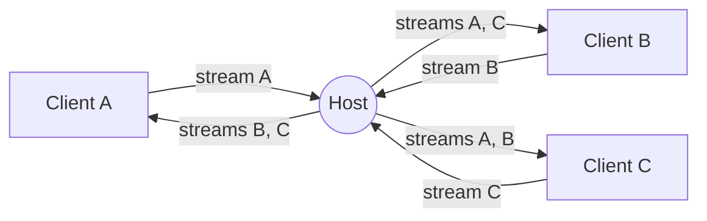

<div align="center">
    <a href="https://www.predatorray.me/rendezvous/" target="_blank"></a>
    <h3><em>海内存知己，天涯若比邻。</em></h3>
</div>

<p align="center">
    一款<b><i>无服务器</i></b>、类似 Zoom 的视频会议 Web 应用，<br>
    基于 WebRTC，使用 React、TypeScript、MUI 和 PeerJS 构建。
</p>

<p align="center">
    <a href="https://discord.gg/VPYRT538n"></a>
    <a href="https://github.com/predatorray/rendezvous/blob/main/LICENSE"></a>
    <a href="https://github.com/predatorray/rendezvous/actions/workflows/ci.yml"></a>
    <a href="https://github.com/predatorray/rendezvous/actions/workflows/publish.yml"></a>
</p>

<p align="center">
    <a href="README.de.md">Deutsch</a> ·
    <a href="README.md">English</a> ·
    <a href="README.es.md">Español</a> ·
    <a href="README.fr.md">Français</a> ·
    <a href="README.ja.md">日本語</a> ·
    <a href="README.ko.md">한국어</a> ·
    <a href="README.pt.md">Português</a> ·
    <a href="README.ru.md">Русский</a> ·
    <b>中文</b>
</p>

---

👉 **在线体验：<https://www.predatorray.me/rendezvous/>**

<p align="center">
  
  
</p>

这里没有应用服务器——每场会议的**主持人**充当聊天消息和媒体流的中继枢纽，
因此每位参与者只需与主持人保持连接，而无需与其他每位参与者相连。PeerJS
公共代理仅用于最初的 WebRTC 信令。

## 关于名称

*Rendezvous* 得名于位于惠斯勒村黑梳山（Blackcomb Mountain）顶部的
[Rendezvous Lodge](https://www.whistlerblackcomb.com/)——作者与滑雪伙伴们相聚的地方。

## 功能特性

- 取个名字，主持一场会议，或通过代码或链接加入已有会议
- 6 个字母、便于阅读的会议代码（约 3 亿种组合）
- 带自动布局的平铺式视频网格
- 参与者摄像头关闭时，方块上显示其姓名首字母
- 静音/取消静音、开启/关闭视频（方块上显示静音图标）
- 可折叠的右侧聊天抽屉，带时间戳以及加入/离开提示
- 聊天记录由主持人保存，迟到者也能看到此前的消息
- 可分享的邀请链接和可复制的会议代码
- 主持人离开后，会议对所有人结束
- 无需账户、无需密码，完全可作为静态站点部署

## 技术栈

- React 19 + TypeScript（Create React App）
- MUI v7（受 Zoom 启发的深色、极简主题）
- React Router v7（用于静态托管的 `HashRouter`）
- 用于信令和 WebRTC 编排的 PeerJS
- 用于 GitHub Pages 部署的 `gh-pages`

## 本地运行

```bash
npm install
npm start
```

打开 <http://localhost:3000>。要测试多方会议，可打开更多隐身窗口并使用
相同的会议代码。

## 构建

```bash
npm run build
```

在 `build/` 中输出静态包，可从任意 CDN 提供服务。该应用使用 `HashRouter`，
因此在不支持客户端 SPA 重写的托管平台（如 GitHub Pages）上也能正常工作。

## 部署到 GitHub Pages

1. 在 `package.json` 中添加指向你 Pages URL 的 `homepage` 字段：

   ```json
   "homepage": "https://YOUR_USER.github.io/rendezvous"
   ```

2. 推送到 GitHub，然后运行：

   ```bash
   npm run deploy
   ```

   这会构建并使用 `gh-pages` 将 `build/` 目录推送到 `gh-pages` 分支。在
   仓库的 设置 → Pages 中，从 `gh-pages` 分支启用 Pages。

## 架构

- `src/peer/MeetingClient.ts` — 持有 PeerJS 的 `Peer`，并实现主持人（中继）
  与客户端两种行为。
- `src/peer/useMeeting.ts` — 将会议客户端适配到组件状态的 React Hook。
- `src/types.ts` — 共享类型以及通过 PeerJS `DataConnection` 传输的线路协议。
- `src/pages/` — 主页（Home）和会议（Meeting）页面。
- `src/components/` — `VideoGrid`、`VideoTile`、`ChatDrawer`、
  `Controls`、`ShareDialog`。

### 线路协议

客户端与主持人之间通过数据连接交换的消息：

| 类型 | 方向 | 用途 |
| ---- | --------- | ------- |
| `hello` | 客户端 → 主持人 | 连接时发送，携带参与者姓名 |
| `welcome` | 主持人 → 客户端 | 返回分配的 id、名单和时间线 |
| `roster` | 主持人 → 所有人 | 更新后的成员列表（加入、离开、状态） |
| `chat-send` | 客户端 → 主持人 | 新聊天消息草稿 |
| `timeline` | 主持人 → 所有人 | 权威的聊天或系统事件 |
| `state` | 客户端 → 主持人 | 参与者更改了音频/视频 |
| `end` | 主持人 → 所有人 | 主持人即将离开——会议结束 |

### 媒体拓扑

每位参与者向主持人发起恰好一路出站媒体呼叫，携带自己的媒体流。主持人接受
后会：

1. 用该入站媒体流呼叫其他所有已连接的客户端，并以 `metadata.peerId` 标记，
   以便接收方知道它代表哪位参与者。
2. 当有新客户端加入时，将自己的媒体流以及所有现有的远端媒体流推送给该客户端。

这使得每位客户端与主持人之间的信令会话数量保持恒定（一条数据连接 + N 条
媒体连接），从而避免了经典的 O(N²) 网状结构。



## 局限性 / 注意事项

- 主持人的上行带宽限制了会议规模（中继运行在消费级浏览器标签页中）。
- 通过主持人转发远端轨道会对其重新编码；质量受限于 `getUserMedia` 和浏览器
  WebRTC 协议栈所协商的结果。
- 默认使用 PeerJS 代理；用于生产环境时，你可以自行托管 PeerServer 并将其
  传给 `Peer` 构造函数。
- 只有当每位参与者都能建立直接的点对点连接（主机候选，或通过 STUN 为锥形
  NAT 后的端点获取的服务器自反候选）时，“无服务器”这一特性才成立。如果有
  任何参与者位于对称 NAT 之后，ICE 将无法协商出直接路径，媒体/数据会经由
  TURN 服务器中继——也就是说，流量将由第三方服务器代理转发，而非在对等端
  之间直接流动。

[1]: https://github.com/predatorray/rendezvous/blob/main/LICENSE
[2]: https://github.com/predatorray/rendezvous/actions/workflows/ci.yml
